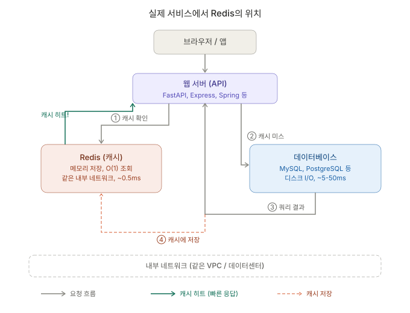
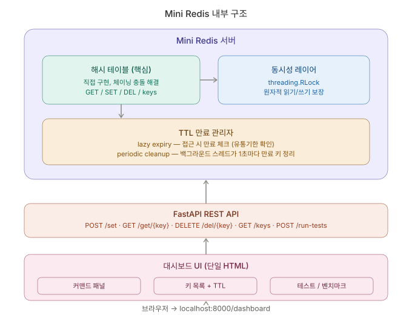

# Mini Redis

해시 테이블을 직접 구현하고, FastAPI로 외부에서 접근할 수 있게 감싼 미니 Redis 프로젝트입니다.  
단순 키-값 저장을 넘어서 TTL, 동시성 제어, REST API, 대시보드, 벤치마크, 테스트까지 포함해 "왜 캐시가 필요한가"를 직접 설명할 수 있게 만드는 데 초점을 맞췄습니다.

## 1. 왜 Redis인가

큰 시스템에서는 모든 요청을 매번 데이터베이스로 보내면 비용이 큽니다.  
특히 자주 조회되는 데이터는 디스크 I/O, 쿼리 실행, 네트워크 왕복 때문에 응답이 느려질 수 있습니다.

Redis 같은 메모리 캐시는 이런 문제를 줄이기 위해 데이터베이스 앞단에 놓입니다.

흐름은 보통 다음과 같습니다.

사용자 요청  
-> 애플리케이션 서버  
-> 먼저 캐시 조회  
-> 있으면 바로 응답  
-> 없으면 DB 조회 후 캐시에 저장  
-> 다음 요청부터는 빠르게 응답

즉, Redis를 쓰는 핵심 이유는 "같은 데이터를 반복해서 비싸게 읽지 않기 위해서"입니다.  
이번 프로젝트는 그 원리를 직접 구현하면서, 캐시가 유리한 경우와 불리한 경우까지 확인하는 데 목적이 있습니다.

### 실제 Redis 흐름



## 2. 아키텍처

우리 시스템은 3계층으로 나뉩니다.

1. `hashtable.py`  
직접 구현한 해시 테이블입니다. 파이썬 내장 `dict` 대신 배열과 chaining으로 키-값 저장소를 만듭니다.

2. `store.py`  
해시 테이블 위에 동시성 제어와 TTL 기능을 얹은 래퍼입니다. `threading.RLock`으로 읽기/쓰기를 보호하고, lazy expiry와 periodic expiry로 만료 키를 정리합니다.

3. `api.py`  
FastAPI 기반 REST API 계층입니다. 외부 요청을 받아 `MiniRedis`를 호출하고 JSON 응답으로 돌려줍니다.

추가로:

- `dashboard.html`: 단일 HTML 대시보드
- `benchmark.py`: SQLite와 Mini Redis를 비교하는 벤치마크
- `tests/`: 단위 테스트 + API 테스트

### Mini Redis 구조



## 3. 파일 구조

```text
mini-redis/
├── mini_redis/
│   ├── hashtable.py       # 해시 테이블 직접 구현 (A)
│   ├── store.py           # Lock + TTL 래퍼 (B)
│   ├── api.py             # FastAPI 엔드포인트 (C)
│   └── dashboard.html     # 대시보드 UI (C)
├── tests/
│   ├── test_hashtable.py  # 해시 테이블 단위 테스트
│   ├── test_store.py      # 동시성 + TTL 테스트
│   └── test_api.py        # API E2E 테스트
├── benchmark.py           # 캐시 성능 비교
└── README.md
```

## 4. 역할 분담

| 담당 | 이름 | 주요 파일 | 역할 |
|---|---|---|---|
| A | 김용 | `hashtable.py`, `test_hashtable.py` | 해시 테이블 직접 구현, collision 처리, resize, 단위 테스트 |
| B | 김정환 | `store.py`, `test_store.py` | `MiniRedis` 래퍼 구현, `RLock`, TTL, cleanup thread, 동시성/TTL 테스트 |
| C | 나지운 | `api.py`, `dashboard.html`, `benchmark.py`, `test_api.py` | FastAPI API, 대시보드 UI, 벤치마크, API E2E 테스트, 프로젝트 통합 |

## 5. 핵심 설계 원리

### 5-1. 해시 테이블

해시 테이블은 key를 숫자로 바꾼 뒤, 그 숫자를 배열 인덱스로 사용해 값을 저장합니다.  
이 프로젝트에서는 Python의 `hash()`를 이용해 bucket index를 계산하고, 내부 저장은 bucket 배열 + chaining 방식으로 구현했습니다.

왜 이렇게 했는가:

- 평균적으로 빠른 조회를 만들기 위해
- `dict` 없이도 키-값 저장 원리를 직접 보여주기 위해

충돌이 나면:

- 같은 bucket에 여러 key가 들어갈 수 있으므로 chaining으로 처리합니다

resize가 필요한 이유:

- bucket이 너무 차면 충돌이 늘어나 성능이 떨어집니다
- 그래서 load factor를 넘으면 capacity를 2배로 늘리고 전체를 다시 배치합니다

### 5-2. 동시성

API 서버는 여러 요청을 동시에 받을 수 있으므로, 저장소 접근은 안전해야 합니다.  
`store.py`에서는 `threading.RLock`으로 모든 읽기/쓰기를 보호합니다.

왜 `Lock`이 아니라 `RLock`인가:

- 같은 스레드가 이미 락을 잡은 상태에서 내부 함수 호출로 다시 락을 잡을 수 있기 때문입니다
- TTL 검사나 cleanup 과정에서 재진입 가능성이 있어 `RLock`이 더 안전합니다

### 5-3. TTL

TTL은 "이 키를 몇 초 뒤 자동으로 만료시킬지" 정하는 기능입니다.

이번 구현에서는 두 가지 방식이 함께 들어갑니다.

1. lazy expiry  
- `get()`이나 `exists()` 시점에 만료 여부를 검사  
- 이미 만료됐으면 그 자리에서 삭제

2. periodic expiry  
- 백그라운드 스레드가 주기적으로 만료 키를 정리

왜 둘 다 쓰는가:

- lazy expiry만 있으면 접근되지 않는 만료 키가 계속 남을 수 있음
- periodic expiry만 있으면 조회 순간의 정확성이 약해질 수 있음

즉, 조회 정확성과 저장소 정리를 같이 잡기 위한 설계입니다.

## 6. 캐싱 전략과 벤치마크

이번 벤치마크는 "인위적으로 느린 계산"이 아니라, SQLite 기반 조회와 Mini Redis 기반 메모리 캐시를 비교해 캐시가 유리한 조건과 불리한 조건을 함께 확인하도록 설계했습니다.

| 시나리오 | 데이터 규모 | 조회 횟수 | 조회 패턴 | TTL | sleep | 기대 캐시 히트율 | 핵심 의도 | 기대 결과 |
|---|---:|---:|---|---|---|---|---|---|
| S1. 반복 조회 | 10,000건 | 1,000회 | 70% 인기 상품 10개, 30% 전체 랜덤 | 없음 | 없음 | 높음 | 자주 조회되는 데이터는 캐시가 유효함을 확인 | Mini Redis가 더 빠름 |
| S2. 매번 다른 키 | 10,000건 | 1,000회 | 1~1000번 상품 각 1회 | 없음 | 없음 | 0%에 가까움 | 캐시 히트가 없으면 오버헤드가 생김을 확인 | Redis 이점이 거의 없거나 더 느릴 수 있음 |
| S3. 짧은 TTL | 10,000건 | 200회 | S1과 같은 혼합 패턴 | 1초 | 0.05초 양쪽 동일 | 중간 이하 | TTL이 짧으면 캐시 효과가 줄어드는지 확인 | S1보다 느리고, hit/miss가 더 나빠짐 |

이 벤치마크에서 확인하고 싶은 핵심 교훈은 세 가지입니다.

1. 반복 조회에서는 캐시가 강하다
2. 매번 다른 데이터를 읽으면 캐시가 별 도움이 안 된다
3. TTL이 너무 짧으면 캐시가 자주 만료돼 성능 이점이 줄어든다

## 7. 테스트와 데모

이 프로젝트는 구현만 한 것이 아니라 테스트로 동작을 고정했습니다.

테스트 범위:

- 해시 테이블 CRUD, collision, resize
- store의 TTL, 동시성, flush, info
- API의 `set/get/delete/keys/info/flush/run-tests/run-benchmark/dashboard`

또한 단일 HTML 대시보드를 통해 라이브 시연이 가능합니다.

대시보드에서 가능한 것:

- 키 저장, 조회, 삭제
- TTL이 줄어드는 모습 확인
- 테스트 실행
- 벤치마크 실행
- 시나리오별 결과 확인

즉, 코드 설명뿐 아니라 브라우저에서 바로 동작을 보여줄 수 있습니다.

## 8. AI 활용과 배운 점

이번 프로젝트에서는 Codex를 적극 활용해 병렬 개발 속도를 높였습니다.  
다만 AI가 준 결과를 그대로 믿지 않고, 항상 왜 그렇게 설계했는지 검토하는 과정이 중요했습니다.

대표 사례:

- 초기 벤치마크는 `sleep`과 계산 지연 중심이었지만, 이 방식은 "왜 Redis가 필요한가"를 제대로 설명하지 못했습니다
- 그래서 SQLite vs Mini Redis 비교로 방향을 바꿨고
- 캐시 히트율, TTL, 고유 조회 패턴까지 포함해 더 현실적인 벤치마크로 재설계했습니다

배운 점:

- AI는 빠른 초안을 만드는 데 강하다
- 하지만 문제 정의와 기준 설정은 사람이 해야 한다
- 결국 "이 결과가 정말 맞는가?"를 계속 의심하는 태도가 가장 중요했다

## 9. 실행 방법

```bash
cd mini-redis
source .venv/bin/activate
uvicorn mini_redis.api:app --reload
```

접속:

- `/docs`
- `/redoc`
- `/dashboard`

## 10. 테스트 실행

```bash
PYTHONPATH=. pytest -v
```

## 11. 벤치마크 실행

```bash
PYTHONPATH=. python benchmark.py
```
